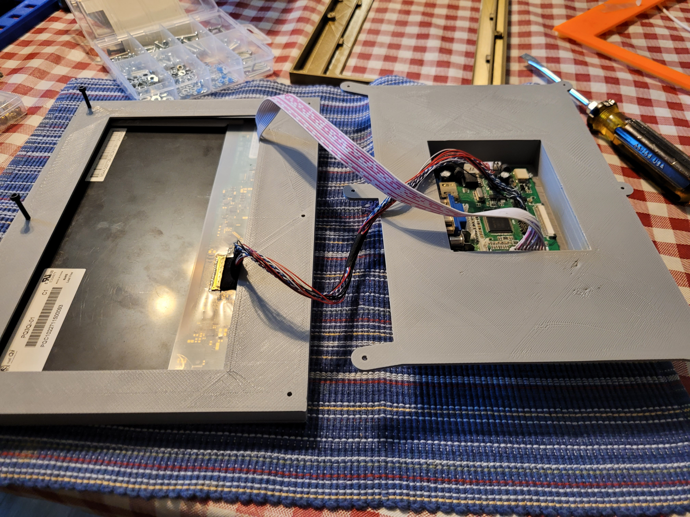
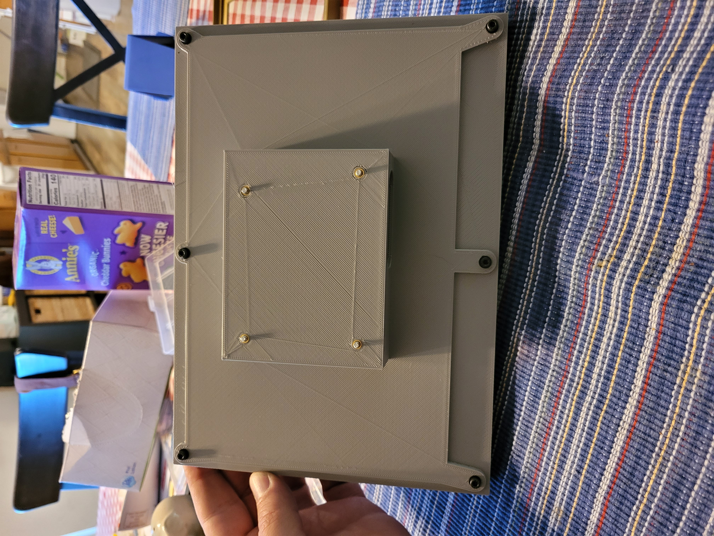
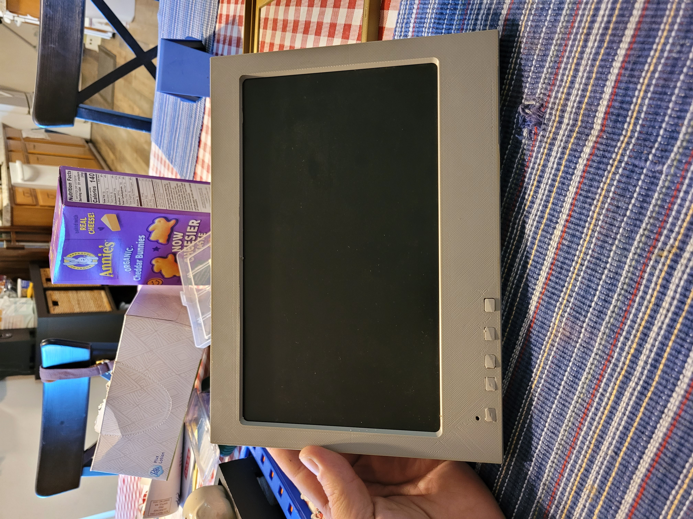

# Pixel Qi Frame

3D printed frame for [Pixel Qi](https://www.adafruit.com/product/1303)
LCD panel. Includes adafruit hdmi [LVDS display driver
board](https://cdn-shop.adafruit.com/datasheets/PCB800099.pdf).  The
frame was modeled in OpenScad and is fully parametric. Conceivably it
can accomodate other types of LCD panels, with proper adjustment of
the parameters.

## OpenScad main file
display_frame.scad

## Included files
1. frameconfig.scad
2. button.scad
3. frame.scad
4. graphics_box.scad

## Pictures of printed frame

